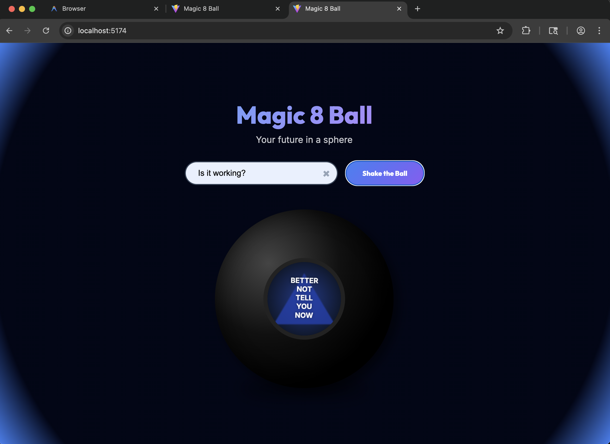

# Classic Magic 8-Ball

A stunning, interactive 3D-styled Magic 8-Ball single-page app. Shake the ball to reveal your destiny with smooth animations and authentic visual effects.



## Features

- **Interactive Experience**: Shake the 8-Ball to get answers to your deepest questions.
- **Premium Design**: Sleek dark mode aesthetics with glassmorphism and dynamic 3D-like animations.
- **Authentic Response**: Classic Magic 8-Ball answers displayed in a realistic floating triangle.
- **Responsive Layout**: Works beautifully on both desktop and mobile devices.

- **Single HTML entry
- **Canvas-driven rendering
- **No page reloads

## Tech Stack

- **Framework**: [Vite](https://vitejs.dev/)
- **Language**: [TypeScript](https://www.typescriptlang.org/)
- **Styling**: Vanilla CSS with modern aesthetics
- **Structure**: Semantic HTML5

## Getting Started

### Prerequisites

- [Node.js](https://nodejs.org/) (version 18 or higher recommended)
- npm (comes with Node.js)

### Installation

1. Clone the repository:
   ```bash
   git clone <repository-url>
   ```

2. Install dependencies:
   ```bash
   npm install
   ```

3. Start the development server:
   ```bash
   npm run dev
   ```

4. Open your browser and navigate to the URL provided by Vite (usually `http://localhost:5173`).

## Usage

1. Type your question in the input field (optional).
2. Click on the 8-Ball or shake your device (if mobile) to receive an answer.
3. Wait for the answer to float to the surface!

---

Built with ❤️ by Antigravity
